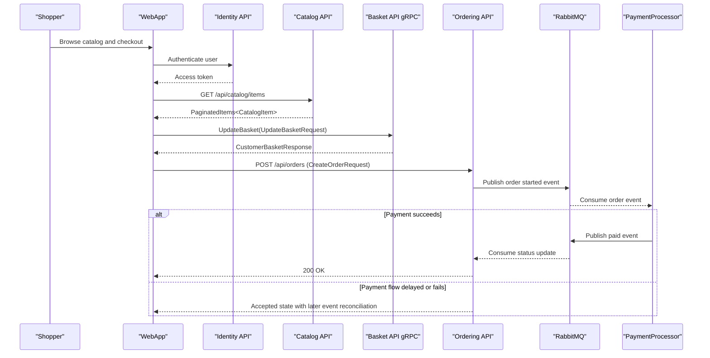

# API & Service Communication Contracts

The solution exposes multiple versioned HTTP APIs plus a gRPC basket contract, with synchronous request/response flows for user operations and asynchronous RabbitMQ events for cross-service propagation.

## Service Catalog

| Service | Port | Category | Purpose |
|---|---|---|---|
| webapp | 5045 / 7298 | API Layer | Storefront UI and backend-for-frontend orchestration |
| mobile-bff | Aspire-managed | API Layer | YARP gateway for mobile-facing composition |
| catalog-api | 5222 | Business | Product catalog query and maintenance |
| ordering-api | 5224 | Business | Order lifecycle commands and queries |
| basket-api | 5221 | Business | Basket read/write via gRPC over HTTP/2 |
| identity-api | 5223 / 5243 | Infrastructure | Identity and token service |
| webhooks-api | 5227 | Business | Webhook subscription management |
| order-processor | 16888 | Business | Background event consumer for order updates |
| payment-processor | 5226 | Business | Payment simulation and event publication |

## API Endpoints Inventory

| Service | Method | Path | Request Type | Response Type |
|---|---|---|---|---|
| Catalog API | GET | /api/catalog/items | query: PaginationRequest | PaginatedItems<CatalogItem> |
| Catalog API | GET | /api/catalog/items/{id:int} | path id | CatalogItem or 404 |
| Catalog API | GET | /api/catalog/items/by | query ids[] | List<CatalogItem> |
| Catalog API | POST | /api/catalog/items | body CatalogItem | 201/200 style create response |
| Catalog API | PUT | /api/catalog/items and /api/catalog/items/{id:int} | body CatalogItem | updated entity result |
| Catalog API | DELETE | /api/catalog/items/{id:int} | path id | 200/404 |
| Ordering API | GET | /api/orders/{orderId:int} | path orderId | Order |
| Ordering API | GET | /api/orders/ | authenticated user context | IEnumerable<OrderSummary> |
| Ordering API | POST | /api/orders/ | body CreateOrderRequest + x-requestid | 200 or 400 |
| Ordering API | POST | /api/orders/draft | body CreateOrderDraftCommand | OrderDraftDTO |
| Ordering API | PUT | /api/orders/cancel | body CancelOrderCommand + x-requestid | 200 or error |
| Ordering API | PUT | /api/orders/ship | body ShipOrderCommand + x-requestid | 200 or error |
| Webhooks API | GET | /api/webhooks/ | authenticated principal | List<WebhookSubscription> |
| Webhooks API | POST | /api/webhooks/ | body WebhookSubscriptionRequest | Created or BadRequest |
| Webhooks API | DELETE | /api/webhooks/{id:int} | path id | Accepted or NotFound |
| Basket API | gRPC | Basket.GetBasket | GetBasketRequest | CustomerBasketResponse |
| Basket API | gRPC | Basket.UpdateBasket | UpdateBasketRequest | CustomerBasketResponse |
| Basket API | gRPC | Basket.DeleteBasket | DeleteBasketRequest | DeleteBasketResponse |

## Management & Observability Endpoints

| Service | Endpoint | Custom Metrics (if any) |
|---|---|---|
| Catalog API | /health, /alive, /openapi, /scalar | OpenTelemetry via ServiceDefaults |
| Ordering API | /health, /alive, /openapi, /scalar | OpenTelemetry via ServiceDefaults |
| Webhooks API | /health, /alive, /openapi, /scalar | OpenTelemetry via ServiceDefaults |
| Basket API | /health, /alive | OpenTelemetry via ServiceDefaults |
| WebApp | /health, /alive | OpenTelemetry via ServiceDefaults |

## DTOs & Contracts

Gateway-facing contracts include composite order and catalog responses consumed by WebApp and mobile-bff. Service-level contracts include `CreateOrderRequest`, `OrderDraftDTO`, `WebhookSubscriptionRequest`, `WebhookSubscription`, `CustomerBasketResponse`, and `UpdateBasketRequest`. Record-based contracts are used in several API handlers (for example `CreateOrderRequest`), while serialization is handled by `System.Text.Json` and gRPC Protobuf contracts for Basket service calls. OpenAPI metadata is defined through endpoint metadata and `AddDefaultOpenApi` in API services.

## Communication Patterns

Synchronous communication is primarily HTTP between WebApp and domain APIs, plus gRPC from clients to Basket API. Asynchronous communication uses RabbitMQ integration events across Catalog, Ordering, PaymentProcessor, OrderProcessor, and Webhooks. Service discovery and endpoint wiring are provided through Aspire references in AppHost instead of hardcoded production hostnames. Startup dependency ordering is modeled in AppHost (`WaitFor` on RabbitMQ, databases, and Ordering API migration dependency). API-level security is implemented with Identity integration and authorization on sensitive routes (`RequireAuthorization()` in Ordering and Webhooks); TLS is enabled in local profiles where https endpoints are configured.

## Service Technology Matrix

| Service | Web | Data Access | Discovery | Gateway | Actuator | Cache | Metrics |
|---|---|---|---|---|---|---|---|
| webapp | Blazor server | API client only | Aspire refs | BFF behavior | /health | No | OpenTelemetry |
| catalog-api | Minimal API | EF Core Npgsql | Aspire refs | No | /health, OpenAPI | No | OpenTelemetry |
| ordering-api | Minimal API | EF Core Npgsql + Dapper queries | Aspire refs | No | /health, OpenAPI | No | OpenTelemetry |
| basket-api | gRPC | Redis repository | Aspire refs | No | /health | Redis | OpenTelemetry |
| webhooks-api | Minimal API | EF Core Npgsql | Aspire refs | No | /health, OpenAPI | No | OpenTelemetry |
| identity-api | MVC plus IdentityServer | Identity EF stores | Aspire refs | No | /health | No | OpenTelemetry |
| mobile-bff | YARP routes | N/A | Aspire refs | Yes | Inherited host | No | Host telemetry |

## Service Communication Sequence

