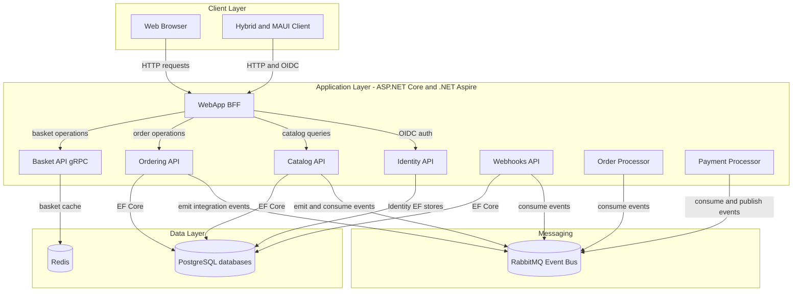
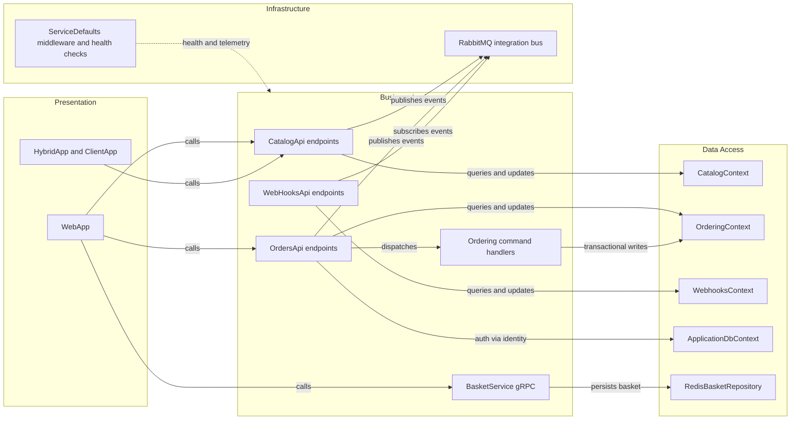

# Architecture Diagram

This document summarizes the eShop reference application's runtime architecture and key component relationships across its service-oriented .NET solution.

## Application Architecture

### Technology Stack Summary

| Layer | Technology | Version | Purpose |
|---|---|---|---|
| Presentation | ASP.NET Core minimal APIs and Blazor WebApp | .NET 9 target in repo | User-facing web and API endpoints |
| Orchestration | .NET Aspire AppHost | Aspire 13.2.0 | Local distributed app composition |
| Business | MediatR, FluentValidation | MediatR 13.0.0, FluentValidation 12.0.0 | Command and validation flows |
| Data | EF Core with Npgsql, Redis | EF Core 10 packages, Npgsql 10.0.1 | Relational persistence and basket caching |
| Integration | RabbitMQ event bus | Aspire RabbitMQ integration | Async integration events |

### Data Storage & External Services

The solution uses PostgreSQL databases (catalogdb, orderingdb, identitydb, webhooksdb) for transactional data, Redis for basket state, and RabbitMQ for integration events between domain services. Identity is provided by Identity API and consumed by APIs and clients through OIDC/JWT.

### Key Architectural Decisions

- Uses service-per-domain APIs with an Aspire AppHost to model dependencies and startup ordering.
- Uses asynchronous integration events over RabbitMQ for cross-service eventual consistency.
- Keeps basket state in Redis while order, catalog, identity, and webhook registration data remain relational in PostgreSQL.

## Component Relationships

### Component Inventory

| Component | Layer | Type | Responsibility |
|---|---|---|---|
| WebApp | Presentation | Blazor server app | User storefront and orchestration of API calls |
| CatalogApi | Business Logic | Minimal API endpoints | Catalog read and write operations |
| OrdersApi | Business Logic | Minimal API endpoints | Order creation, retrieval, cancellation, shipping |
| BasketService | Business Logic | gRPC service | Basket CRUD interactions |
| WebHooksApi | Business Logic | Minimal API endpoints | Webhook subscription lifecycle |
| OrderingContext | Data Access | EF Core DbContext | Ordering aggregate persistence and transactions |
| CatalogContext | Data Access | EF Core DbContext | Catalog entities and integration outbox |
| RedisBasketRepository | Data Access | Repository | Redis-backed customer basket storage |
| ServiceDefaults | Infrastructure | Middleware and extensions | OpenTelemetry, health checks, resilience |
| RabbitMQ Event Bus | Infrastructure | Message broker integration | Integration event transport across services |
