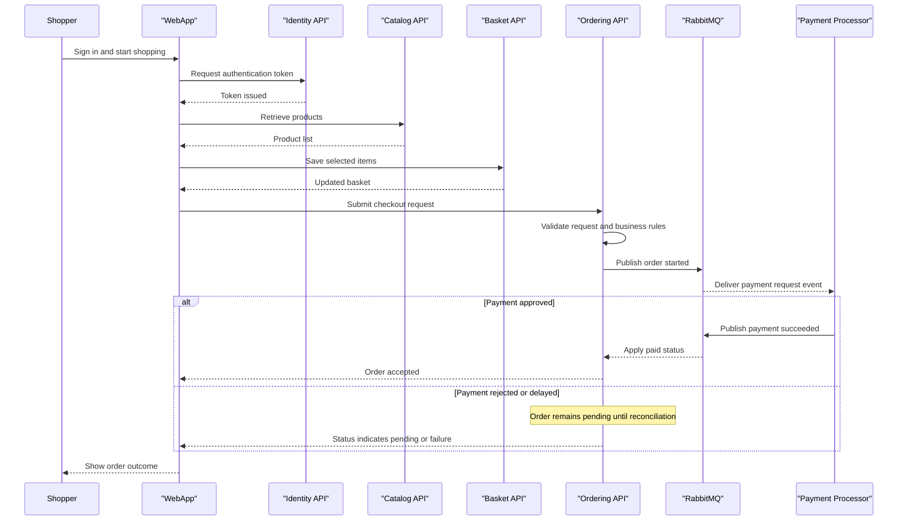

# Core Business Workflows

eShop models a retail purchase journey where users browse products, manage baskets, place orders, and receive downstream processing updates through event-driven services.

## Domain Entities

| Entity | Service / Bounded Context | Description | Key Relationships |
|---|---|---|---|
| CatalogItem | Catalog Management | Product published for browsing and purchase | Linked to CatalogBrand and CatalogType |
| CustomerBasket | Basket Management | User shopping basket before checkout | Contains multiple BasketItem entries |
| Order | Ordering | Purchase transaction lifecycle | Owned by Buyer and contains OrderItems |
| Buyer | Ordering | Shopper identity in ordering context | Owns PaymentMethods and Orders |
| WebhookSubscription | Notifications | User webhook registration for order events | Belongs to authenticated user |
| ApplicationUser | Identity | Authentication and authorization principal | Issues tokens consumed by APIs |

## Service-to-Domain Mapping

| Service | Domain Context | Owned Entities | External Dependencies |
|---|---|---|---|
| Catalog.API | Catalog Management | CatalogItem, CatalogBrand, CatalogType | PostgreSQL, RabbitMQ |
| Basket.API | Basket Management | CustomerBasket, BasketItem | Redis, Identity |
| Ordering.API | Order Management | Order, OrderItem, Buyer, PaymentMethod, CardType | PostgreSQL, RabbitMQ, Identity |
| PaymentProcessor | Payment Processing | Payment event state | RabbitMQ |
| OrderProcessor | Fulfillment Processing | Order status handling | RabbitMQ, Ordering database |
| Webhooks.API | Notification Subscription | WebhookSubscription | PostgreSQL, RabbitMQ, Identity |
| Identity.API | Access Management | ApplicationUser and identity records | PostgreSQL |

## Primary Workflows

### Workflow 1: Browse catalog and place order

1. Shopper authenticates through Identity and receives an access token.
2. Shopper browses catalog items from Catalog API.
3. Shopper updates basket contents through Basket API.
4. Shopper submits checkout to Ordering API with basket and payment data.
5. Ordering validates command identity and creates order aggregate.
6. Ordering publishes integration events for payment and follow-up processing.

### Workflow 2: Payment and order status progression

1. PaymentProcessor consumes order-started events.
2. PaymentProcessor emits paid or failed outcome events.
3. Ordering and OrderProcessor consume these events and update order status.
4. Webhooks API can distribute status changes to registered subscriber endpoints.

## Cross-Service Data Flows

WebApp composes user experience from multiple domain APIs: catalog data from Catalog API, basket data from Basket API, and order state from Ordering API. Event-driven data propagation occurs through RabbitMQ where ordering, payment, and webhook services exchange status events. If a downstream processor is delayed, ordering remains eventually consistent and status is reconciled when events are consumed.

## Business Workflow Sequence

## Business Rules & Decision Logic

- Order commands require a non-empty request identifier for idempotent handling in ordering flows.
- Checkout and shipping/cancel operations require authenticated access and service-level authorization.
- Basket updates require authenticated user identity and map basket items per user scope.
- Payment results drive order state transitions asynchronously through integration events.
- Ordering transaction boundaries are enforced in `OrderingContext` and mediated command handlers.
