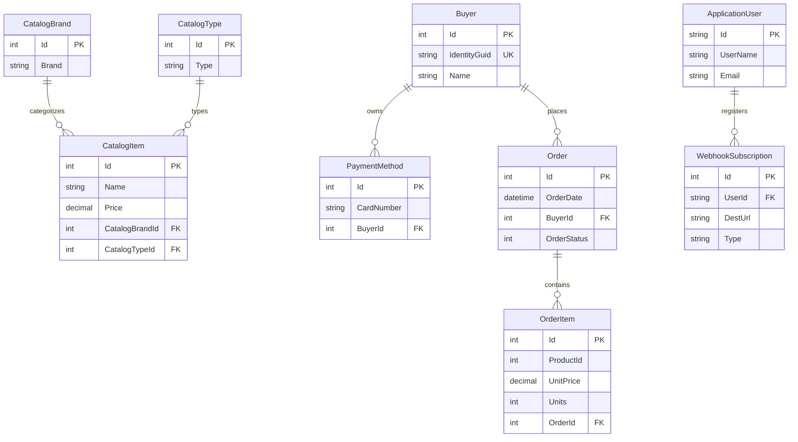

# Data Architecture & Persistence Layer

The eShop data layer combines PostgreSQL-backed EF Core contexts for core domains with Redis for low-latency basket state, and uses integration-event outbox tables in catalog and ordering contexts.

## Database Configuration

| Service/Module | DB Type | Profile | Driver | Connection | Migration Tool |
|---|---|---|---|---|---|
| Catalog.API | PostgreSQL | Development and Aspire default | Npgsql EF Core provider | `CatalogDB` connection string | EF Core migrations in `Infrastructure/Migrations` |
| Ordering.API / Ordering.Infrastructure | PostgreSQL | Development and Aspire default | Npgsql EF Core provider | `OrderingDB` connection string | EF Core migrations in `Ordering.Infrastructure/Migrations` |
| Identity.API | PostgreSQL | Development and Aspire default | Npgsql via ASP.NET Identity EF | `IdentityDB` connection string | EF Core migrations in `Data/Migrations` |
| Webhooks.API | PostgreSQL | Development and Aspire default | Npgsql EF Core provider | `WebHooksDB` connection string | EF Core migrations in `Migrations` |
| Basket.API | Redis | Development and Aspire default | StackExchange.Redis | `Redis` connection string | Not applicable |

## Data Ownership per Service

| Service | Tables Owned | ORM Framework | Caching | Notes |
|---|---|---|---|---|
| Catalog.API | CatalogItems, CatalogBrands, CatalogTypes, IntegrationEventLog | EF Core | None | Catalog read/write plus integration outbox |
| Ordering.API | Orders, OrderItems, Buyers, Payments, CardTypes, ClientRequests, IntegrationEventLog | EF Core and Dapper queries | None | Transactional order aggregate with idempotency records |
| Identity.API | AspNetUsers and identity tables | ASP.NET Identity EF Core | None | Authentication and token identity data |
| Webhooks.API | Subscriptions | EF Core | None | User webhook registrations |
| Basket.API | Redis key space `/basket/<buyerId>` | Repository over Redis | Redis | Key-value basket document storage |

## Entity Model

## Key Repository Methods

| Service | Repository | Notable Methods | Purpose |
|---|---|---|---|
| Ordering | `OrderRepository` | `GetAsync(int orderId)` | Loads order plus order items for read models |
| Ordering | `BuyerRepository` | `FindAsync(string identity)`, `FindByIdAsync(int id)` | Resolves buyer and payment methods |
| Basket | `RedisBasketRepository` | `GetBasketAsync`, `UpdateBasketAsync`, `DeleteBasketAsync` | Basket cache-aside CRUD by buyer identity |
| Ordering | `IOrderQueries` implementations | `GetOrdersFromUserAsync`, `GetOrderAsync`, `GetCardTypesAsync` | Query-side order retrieval and card type lookup |

## Caching Strategy

Basket.API uses Redis as a primary cache-backed store for customer baskets using key pattern `/basket/<buyerId>`. Other services rely on PostgreSQL without a second-level cache in the observed code paths. This design prioritizes low latency basket operations and keeps order and catalog consistency in relational storage.

## Data Ownership Boundaries

The solution follows a database-per-service pattern for core relational domains (catalogdb, orderingdb, identitydb, webhooksdb), while cross-service consistency is handled through integration events on RabbitMQ rather than direct table sharing. Ordering and catalog each maintain outbox event logs to support event publication. Basket state is isolated in Redis and accessed through Basket API service contracts.

### Data Classification & Sensitivity

| Entity | Sensitive Fields | Classification (PII/PHI/PCI/None) | Controls in Place |
|---|---|---|---|
| ApplicationUser | UserName, Email | PII | Identity framework and auth boundaries; no explicit field-level encryption found |
| Buyer | Name, IdentityGuid | PII | Access through authorized order flows |
| PaymentMethod | CardNumber metadata, card holder details | PCI-related | Masking applied in order logging path; no explicit at-rest field encryption in code |
| WebhookSubscription | DestUrl, Token | Sensitive operational secret | Stored in service DB; no explicit encryption/masking in entity mapping |
| CatalogItem | Product attributes | None | Public catalog data |
