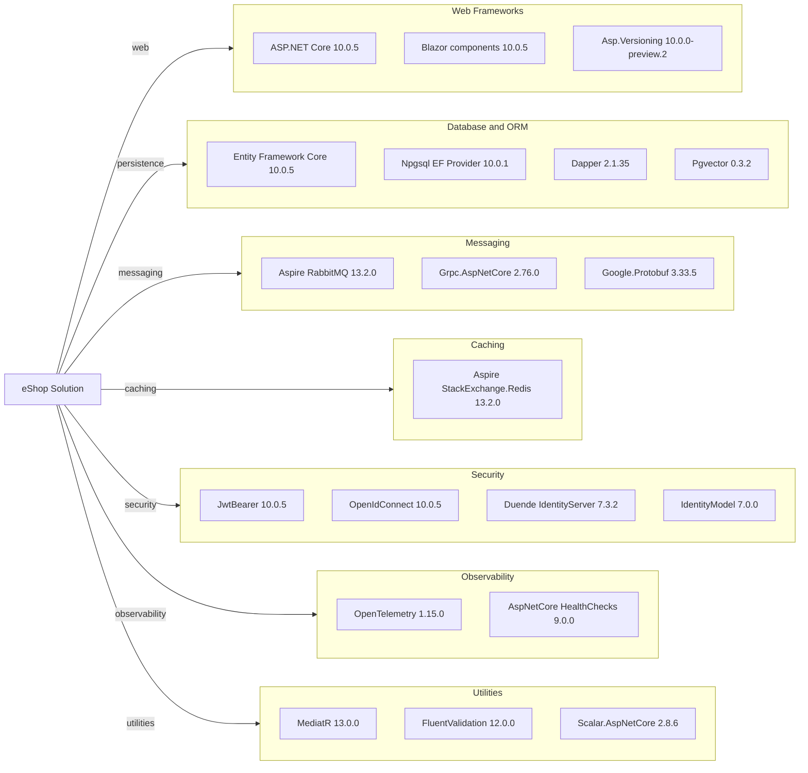

# Dependency Map

This dependency map summarizes declared external dependencies for the eShop solution, using central package management in `Directory.Packages.props` and project-level package references.

## Dependencies

### Dependency Summary

| Category | Count | Key Libraries | Notes |
|---|---:|---|---|
| Web Frameworks | 3 | ASP.NET Core, Blazor, Asp.Versioning | API and UI runtime foundation |
| Database / ORM | 4 | EF Core, Npgsql, Dapper, Pgvector | PostgreSQL-centric persistence |
| Messaging | 3 | RabbitMQ integration, gRPC, Protobuf | Async events and gRPC communication |
| Caching | 1 | StackExchange.Redis integration | Basket state caching |
| Security | 4 | JwtBearer, OpenIdConnect, Duende IdentityServer | Centralized authn and token issuance |
| Observability | 2 | OpenTelemetry, HealthChecks | Distributed tracing and health endpoints |
| Utilities | 3 | MediatR, FluentValidation, Scalar | Cross-cutting app behavior |

### Version & Compatibility Risks

The repository targets .NET 9 while central package versions already track .NET 10 package lines (`10.0.5`), so runtime/tooling drift should be monitored. Duende IdentityServer and preview API versioning packages should be reviewed during platform upgrades for licensing and API compatibility.

### Notable Observations

- Central package management is enabled, which simplifies coordinated upgrades across many projects.
- The stack mixes EF Core and Dapper, indicating both ORM and hand-written query strategies.
- Messaging is split between RabbitMQ (events) and gRPC (basket service contract).
- OpenTelemetry packages are consistently applied, which eases migration observability baselining.

## Test Dependencies

| Framework | Version | Notes |
|---|---|---|
| MSTest | 4.0.2 | Unit and functional test support |
| xUnit v3 | 3.2.1 | Additional test framework usage |
| NSubstitute | 5.3.0 | Mocking and test doubles |
| Microsoft.AspNetCore.Mvc.Testing | 10.0.5 | API integration test host |
| Microsoft.AspNetCore.TestHost | 10.0.5 | In-memory integration tests |

Total test-scope dependencies: 5

The project has mature test infrastructure with both unit and functional capabilities, though some tests require optional workloads in this environment.
