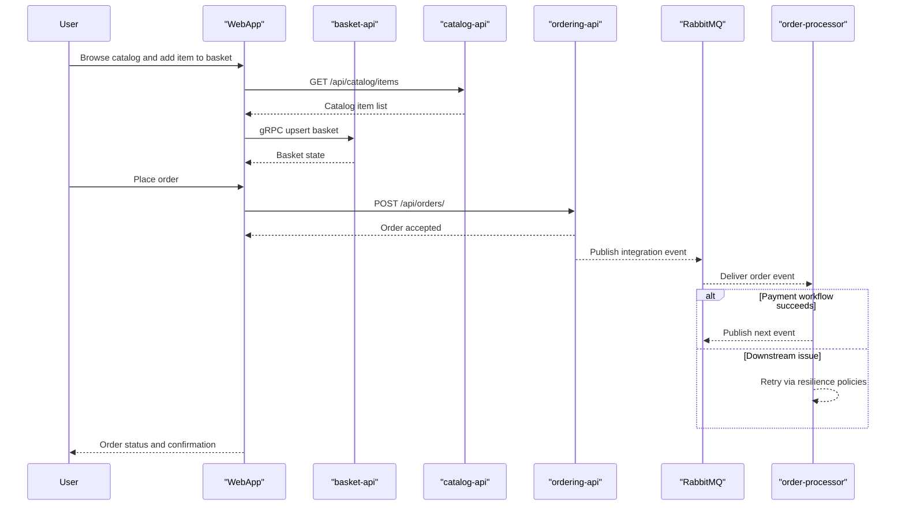

# API & Service Communication Contracts

eShop exposes multiple Minimal API and gRPC endpoints, with synchronous request-response flows for user operations and asynchronous integration events over RabbitMQ for background processing.

## Service Catalog

| Service | Port | Category | Purpose |
|---|---|---|---|
| basket-api | Aspire-assigned | Business | Basket operations over gRPC with Redis storage |
| catalog-api | Aspire-assigned | Business | Catalog browse and item management APIs |
| ordering-api | Aspire-assigned | Business | Order creation, lookup, cancel, and shipping actions |
| webhooks-api | Aspire-assigned | Business | Webhook subscription CRUD APIs |
| identity-api | Aspire-assigned | Infrastructure | Identity and authentication authority |
| order-processor | N/A worker | Business | Handles order-related integration events |
| payment-processor | N/A worker | Business | Handles payment-related integration events |
| webapp | Aspire-assigned | API Layer | Front-end gateway style client interactions |
| mobile-bff | Aspire-assigned | API Layer | YARP reverse proxy for mobile scenarios |

## API Endpoints Inventory

| Service | Method | Path | Request Type | Response Type |
|---|---|---|---|---|
| catalog-api | GET | `/api/catalog/items` | query params | paged item response |
| catalog-api | GET | `/api/catalog/items/{id:int}` | path param id | item DTO |
| catalog-api | POST | `/api/catalog/items` | create item DTO | created item response |
| catalog-api | PUT | `/api/catalog/items/{id:int}` | update item DTO | updated item response |
| catalog-api | DELETE | `/api/catalog/items/{id:int}` | path param id | status only |
| ordering-api | GET | `/api/orders/` | user context | order collection |
| ordering-api | GET | `/api/orders/{orderId:int}` | path param orderId | order detail |
| ordering-api | POST | `/api/orders/` | order request DTO | created order |
| ordering-api | PUT | `/api/orders/cancel` | cancel command | status result |
| webhooks-api | GET | `/api/webhooks/` | auth context | webhook subscriptions |
| webhooks-api | POST | `/api/webhooks/` | webhook subscription DTO | created status |
| webhooks-api | DELETE | `/api/webhooks/{id:int}` | path param id | accepted or not found |
| basket-api | gRPC | `BasketService` methods | protobuf request | protobuf response |

## Management & Observability Endpoints

| Service | Endpoint | Custom Metrics (if any) |
|---|---|---|
| all ASP.NET services via defaults | `/health` | OpenTelemetry ASP.NET and HTTP instrumentation |
| all ASP.NET services via defaults | `/alive` | Liveness-only health tag |
| API services with OpenAPI | `/openapi` and scalar UI route | API metadata and schema exposure |

## DTOs & Contracts

Service-level contracts include catalog item DTOs, ordering commands and order summaries, webhook subscription models, basket protobuf messages, and identity/account models. Gateway-level composition appears in web and mobile clients that aggregate catalog, basket, identity, and ordering responses. Serialization primarily uses `System.Text.Json` for HTTP APIs and protobuf for gRPC paths.

## Communication Patterns

Synchronous communication is primarily HTTP and gRPC between client apps and backend APIs, with service discovery and standard HTTP resilience handlers configured in shared defaults. Asynchronous communication uses RabbitMQ-backed event bus flows for order and payment processing. Startup dependency ordering is handled in Aspire AppHost using `WaitFor` relationships. Authentication and authorization are enforced on protected APIs (for example ordering and webhooks), with Identity API providing token issuance.

## Service Technology Matrix

| Service | Web | Data Access | Discovery | Gateway | Actuator | Cache | Metrics |
|---|---|---|---|---|---|---|---|
| basket-api | gRPC | Redis repository | Yes | No | Health endpoints | Redis | OpenTelemetry |
| catalog-api | Minimal API | EF Core + PostgreSQL | Yes | No | Health + OpenAPI | No | OpenTelemetry |
| ordering-api | Minimal API | EF Core + PostgreSQL | Yes | No | Health + OpenAPI | No | OpenTelemetry |
| webhooks-api | Minimal API | EF Core + PostgreSQL | Yes | No | Health + OpenAPI | No | OpenTelemetry |
| identity-api | MVC plus identity endpoints | EF Core + PostgreSQL | Yes | No | Health | No | OpenTelemetry |
| webapp | Blazor server | API clients | Yes | Partial aggregation | Health | In-memory session patterns | OpenTelemetry |

## Service Communication Sequence

