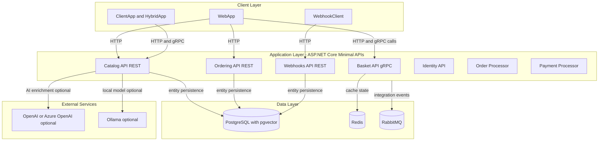
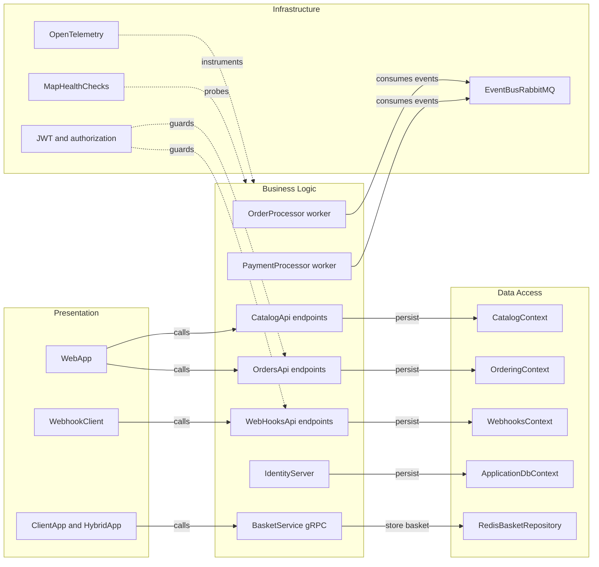

# Architecture Diagram

eShop is a distributed .NET 10 solution orchestrated by .NET Aspire. It combines API services, background processors, and UI clients with shared service defaults.

## Application Architecture

### Technology Stack Summary

| Layer | Technology | Version | Purpose |
|---|---|---|---|
| Presentation | ASP.NET Core Blazor and Razor | .NET 10 | User-facing web and hybrid clients |
| API and Services | ASP.NET Core Minimal APIs and gRPC | .NET 10 | Business APIs and backend processing |
| Data Access | Entity Framework Core with Npgsql and StackExchange.Redis | EF Core 10 stack | Relational and cache persistence |
| Messaging | RabbitMQ via Aspire client packages | Current package-managed | Asynchronous integration events |
| Observability | OpenTelemetry and health checks | Current package-managed | Tracing, metrics, logs, and readiness |

### Data Storage & External Services

The system persists service data in PostgreSQL databases (`catalogdb`, `identitydb`, `orderingdb`, `webhooksdb`), stores shopping basket state in Redis, and uses RabbitMQ for integration events. Optional AI integrations route through OpenAI or Ollama when toggled in the AppHost.

### Key Architectural Decisions

- Uses .NET Aspire AppHost as the orchestration and service composition entry point.
- Centralizes cross-cutting defaults (service discovery, resilience, OpenTelemetry, health checks) in `eShop.ServiceDefaults`.
- Splits concerns into service-specific APIs plus asynchronous processors for order and payment flows.

## Component Relationships

### Component Inventory

| Component | Layer | Type | Responsibility |
|---|---|---|---|
| CatalogApi | Presentation | Minimal API endpoints | Catalog search and item management |
| OrdersApi | Presentation | Minimal API endpoints | Order creation, retrieval, and state changes |
| WebHooksApi | Presentation | Minimal API endpoints | Webhook subscription management |
| BasketService | Business Logic | gRPC service | Basket read and write operations |
| OrderingContext | Data Access | EF Core DbContext | Ordering aggregate persistence |
| CatalogContext | Data Access | EF Core DbContext | Catalog aggregate persistence |
| RedisBasketRepository | Data Access | Repository | Basket state in Redis |
| EventBusRabbitMQ | Infrastructure | Messaging adapter | Publish and subscribe integration events |
