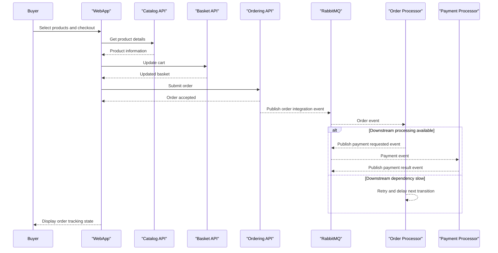

# Core Business Workflows

eShop implements an online storefront flow where users browse products, maintain baskets, place orders, and receive asynchronous processing updates through backend workers.

## Domain Entities

| Entity | Service / Bounded Context | Description | Key Relationships |
|---|---|---|---|
| CatalogItem | Catalog Management | Product listing available to buyers | Linked to CatalogBrand and CatalogType |
| Basket | Basket Management | Temporary user cart before checkout | Contains selected catalog items and quantities |
| Order | Ordering | Confirmed purchase intent and lifecycle | Owned by Buyer and contains OrderItems |
| WebhookSubscription | Integration | Outbound notification target registration | Receives webhook event deliveries |
| ApplicationUser | Identity | Authenticated user account | Drives ownership and authorization context |

## Service-to-Domain Mapping

| Service | Domain Context | Owned Entities | External Dependencies |
|---|---|---|---|
| catalog-api | Catalog | CatalogItem, CatalogBrand, CatalogType | PostgreSQL, RabbitMQ, optional AI services |
| basket-api | Basket | Basket aggregate in Redis | Redis, identity URL, RabbitMQ |
| ordering-api | Ordering | Order aggregate and related value objects | PostgreSQL, RabbitMQ, identity URL |
| webhooks-api | Webhooks | WebhookSubscription | PostgreSQL, RabbitMQ, identity URL |
| identity-api | Identity | User and auth configuration entities | PostgreSQL, client applications |

## Primary Workflows

### Workflow 1: Browse catalog and place order

A user browses catalog items, adds selections to basket via Basket API, and submits an order through Ordering API. Ordering validates input and authorization, persists the order, and emits integration events for downstream processors.

### Workflow 2: Webhook subscription management

An authenticated user creates and manages webhook subscriptions through Webhooks API. Subscriptions are persisted and later used to route relevant integration events to external callback targets.

## Cross-Service Data Flows

Web and mobile clients aggregate data from catalog, basket, ordering, and identity services. Ordering emits domain events to RabbitMQ; order and payment processors consume these events and continue downstream business operations. If event consumers are delayed, the system degrades by delaying status progression rather than blocking order intake.

## Business Workflow Sequence

## Business Rules & Decision Logic

- Order placement requires authenticated context and valid payload before persistence.
- Ordering aggregate controls status transitions (for example draft to submitted to shipped or canceled) through domain logic.
- Integration-event based processing isolates long-running steps and supports retries.
- Webhook subscription operations enforce ownership and authorization before mutation.
