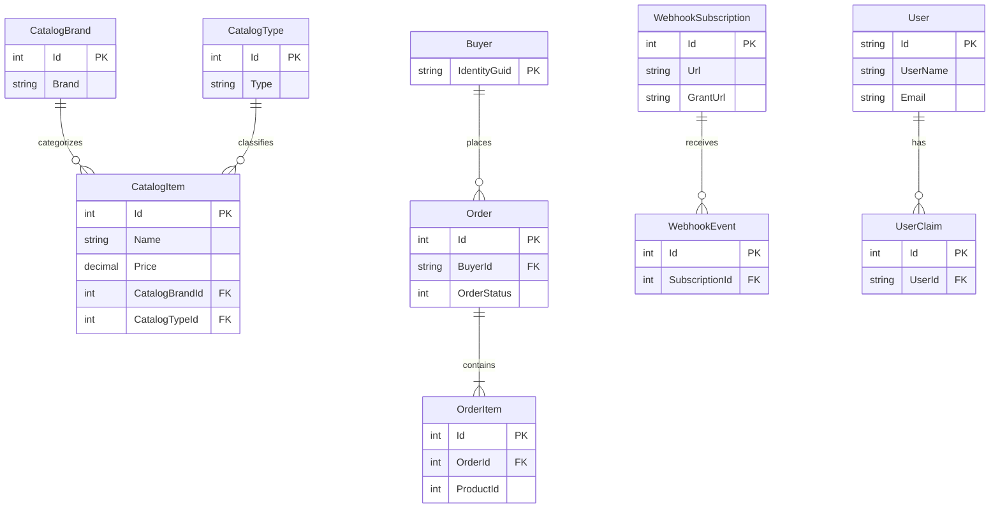

# Data Architecture & Persistence Layer

eShop uses a polyglot persistence pattern centered on PostgreSQL for core transactional data and Redis for basket state, with EF Core as the primary ORM for relational workloads.

## Database Configuration

| Service/Module | DB Type | Profile | Driver | Connection | Migration Tool |
|---|---|---|---|---|---|
| Catalog.API | PostgreSQL | Development and containerized runtime | Npgsql EF Core provider | `catalogdb` connection string | EF Core migrations |
| Ordering.API | PostgreSQL | Development and containerized runtime | Npgsql EF Core provider | `orderingdb` connection string | EF Core migrations |
| Webhooks.API | PostgreSQL | Development and containerized runtime | Npgsql EF Core provider | `webhooksdb` connection string | EF Core migrations |
| Identity.API | PostgreSQL | Development and containerized runtime | Npgsql EF Core provider | `identitydb` connection string | EF Core migrations |
| Basket.API | Redis | Development and containerized runtime | StackExchange.Redis | `redis` service reference | N/A |

## Data Ownership per Service

| Service | Tables Owned | ORM Framework | Caching | Notes |
|---|---|---|---|---|
| Catalog.API | CatalogItem, CatalogBrand, CatalogType, integration event log | EF Core | None explicit | Uses pgvector for semantic relevance |
| Ordering.API | Order aggregate tables, integration event log | EF Core | None explicit | Domain-driven aggregate model |
| Webhooks.API | WebhookSubscription and integration event log | EF Core | None explicit | Subscription lifecycle state |
| Identity.API | ASP.NET Identity tables and identity server config tables | EF Core | None explicit | Authentication source of truth |
| Basket.API | Basket documents keyed by user | Custom repository over Redis | Redis native | Fast mutable shopping basket state |

## Entity Model

## Key Repository Methods

| Service | Repository | Notable Methods | Purpose |
|---|---|---|---|
| Basket.API | `RedisBasketRepository` | `GetBasketAsync`, `UpdateBasketAsync`, `DeleteBasketAsync` | Read and mutate user basket state |
| Ordering.Infrastructure | `OrderRepository` patterns over `OrderingContext` | domain aggregate load and save methods | Persist order aggregate and state transitions |
| Catalog.API | repositories over `CatalogContext` | item paging, filtering by brand and type, lookup by ids | Support catalog browse and detail retrieval |
| Webhooks.API | `WebhooksContext` query flows | subscription get/create/delete operations | Manage webhook subscriptions |

## Caching Strategy

Basket data uses cache-aside style operations over Redis keyed by user identity. Other services primarily rely on relational persistence and async events without an explicit distributed cache layer in core API paths.

## Data Ownership Boundaries

Each business API owns its own PostgreSQL schema and DbContext, while integration events are exchanged through RabbitMQ instead of direct cross-database writes. Web and worker services consume these APIs and events rather than querying service databases directly. Basket state is isolated in Redis and accessed only by Basket API contracts.

### Data Classification & Sensitivity

| Entity | Sensitive Fields | Classification (PII/PHI/PCI/None) | Controls in Place |
|---|---|---|---|
| User and Identity tables | username, email, identity identifiers | PII | IdentityServer and auth controls; no explicit field masking in code |
| Order and Buyer | buyer identifiers, delivery-related metadata | PII | API authorization and service boundaries; no explicit masking shown |
| WebhookSubscription | callback URLs and grant URLs | Sensitive integration metadata | API authorization required |
| Catalog entities | product metadata | None | Public catalog-style data |
| Basket entries | buyer-linked cart contents | PII-adjacent behavioral data | Stored in Redis behind service API |
