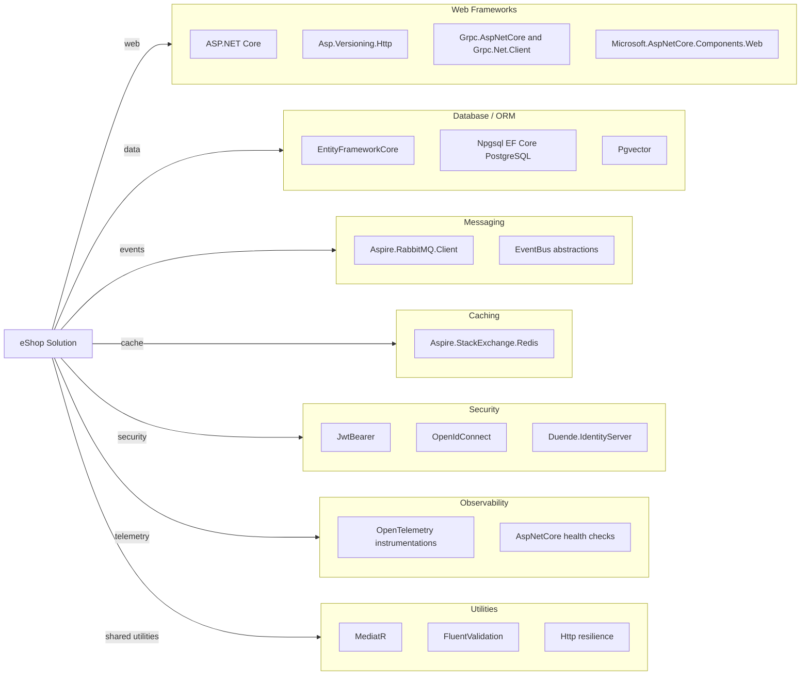

# Dependency Map

This .NET 10 solution uses shared package management and a broad set of service, data, messaging, and observability libraries across API, UI, and worker projects.

## Dependencies

### Dependency Summary

| Category | Count | Key Libraries | Notes |
|---|---:|---|---|
| Web Frameworks | 4 | ASP.NET Core, Asp.Versioning, gRPC, Blazor | Minimal APIs and gRPC used side by side |
| Database / ORM | 3 | EF Core, Npgsql, Pgvector | PostgreSQL-centric persistence |
| Messaging | 2 | RabbitMQ client, EventBus | Event-driven integration between services |
| Caching | 1 | StackExchange.Redis via Aspire | Basket API cache and session-style storage |
| Security | 3 | JwtBearer, OpenIdConnect, Duende IdentityServer | Token-based auth with identity server |
| Observability | 2 | OpenTelemetry, health checks | Unified tracing and readiness endpoints |
| Utilities | 3 | MediatR, FluentValidation, resilience handlers | Domain messaging and validation support |

### Version & Compatibility Risks

Most service projects already target `net10.0`, but MAUI-related projects and tests introduce workload dependencies (for example `maui-tizen`) that may complicate CI environments and upgrade validation pipelines.

### Notable Observations

- Shared service defaults reduce duplication of telemetry, resilience, and auth setup.
- Npgsql and pgvector tie data workloads to PostgreSQL ecosystem features.
- Messaging and worker projects indicate eventual consistency and async order processing.
- Identity relies on Duende IdentityServer packages, which require license and version governance.

## Test Dependencies

| Framework | Version | Notes |
|---|---|---|
| xUnit v3 | package-managed | Unit and functional tests |
| Microsoft.AspNetCore.Mvc.Testing | package-managed | API integration testing |
| Aspire.Hosting.PostgreSQL | package-managed | Functional test environment resources |
| NSubstitute | package-managed | Mocking and substitution in unit tests |

Total test-scope dependencies: 4
Test infrastructure is comprehensive for APIs, but MAUI test workloads require additional SDK workload installation in CI.
